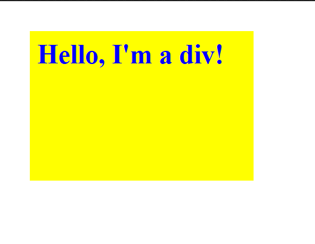

## Change Style of a Div using DOM

This project demonstrates how to use JavaScript DOM manipulation methods to dynamically update the style of a div element. Below are the details and instructions for the project.

## Features

- Consistent and visually appealing UI.

- Proper alignment of elements for a seamless user experience.

- Usage of getElementById to fetch the target element.

- Dynamic updates to the following properties:

- Background color (set to yellow)

- Margin (set to 20 pixels)

- Padding (set to 10 pixels)

- Font size (set to 18 pixels)

- Font weight (set to bold)

- Height (set to 200 pixels)

- Width (set to 300 pixels)

## Tech Stack

**Client:** HTML, CSS, Javascript

## Demo

- [Hosted Link 👉] (https://parichay1811.github.io/DOM-js/)

## Screenshots

## Author

- [@Parichay1811](https://github.com/Parichay1811)
